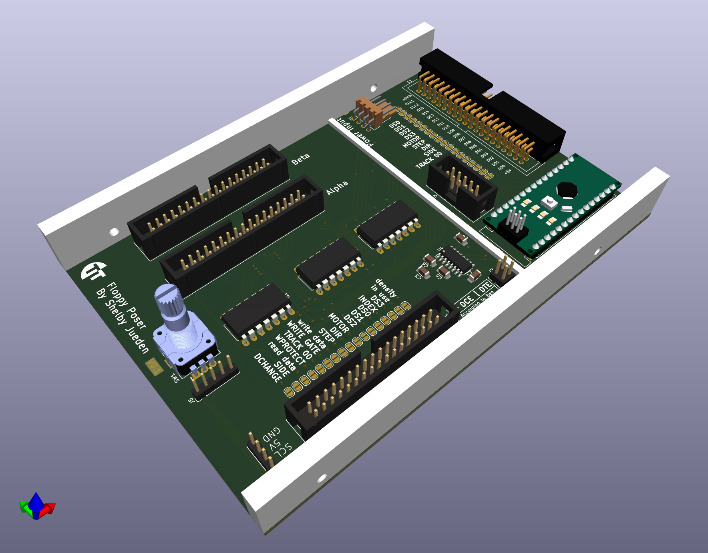

# Floppy Poser

**UNTESTED DESIGN**
*This board has not been produced and ordered yet. The software to drive it doesn't even exist at this time. DO NOT BUILD THIS!*

## What this technically is

This is a ground up redo of my [Floppy Switch Board](https://github.com/AkBKukU/FloppySwitchBoard) that is controlled by an Arduino instead of a switch. Additionally, it uses buffer chips to switch more than before and can switch between two different drive pairs entirely.

## What this really is

I'm working towards a larger project and needed a test bed for a few concepts and the amility to probe a floppy bus with an HP probe pod directly. So this has some more features related to that which are useless for anyone else.
